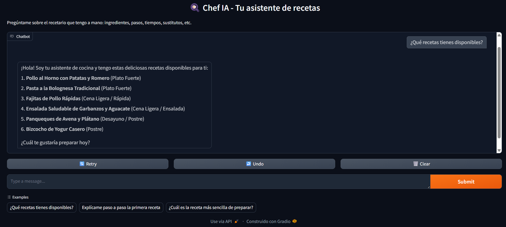
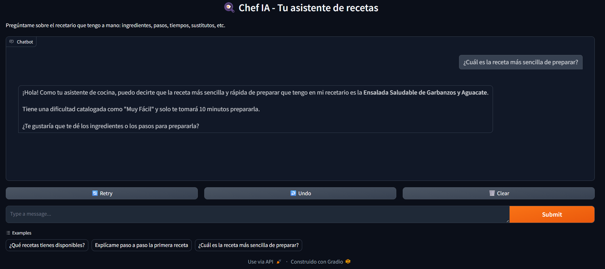
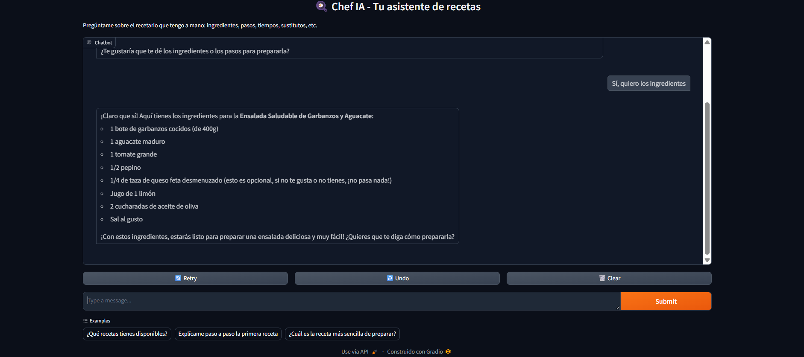
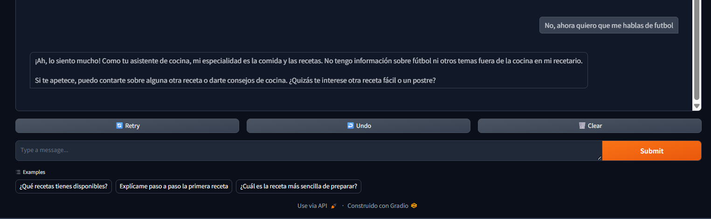
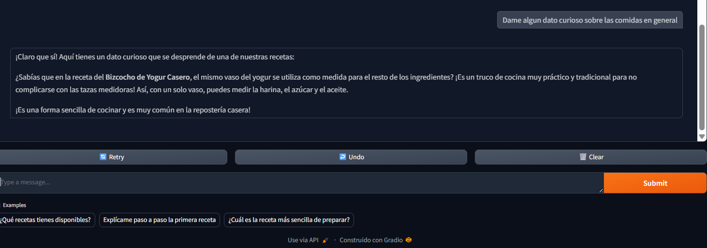

# 🍳 Agente de Cocina con IA (Gemini + PDF)

Asistente conversacional inteligente que responde preguntas sobre un recetario en PDF: explica recetas paso a paso, sugiere sustitutos de ingredientes, adapta cantidades y recomienda platos según lo que el usuario busque. El agente utiliza el modelo **Gemini 2.5 Flash** de Google como motor de lenguaje y **Gradio** como interfaz de chat, y está desplegado en una instancia de **Oracle Cloud Infrastructure (OCI)**.

---

## 📋 Descripción general

Este proyecto nace como parte del Challenge de Alura (Agente de IA), con el objetivo de construir un agente funcional capaz de:

- Leer y extraer el contenido de un documento PDF (recetario de cocina).
- Usar ese contenido como única fuente de verdad para responder preguntas del usuario.
- Mantener una conversación de varios turnos, recordando el contexto previo.
- Responder de forma clara, ordenada y amigable, como si le hablara a alguien que recién está aprendiendo a cocinar.

El agente **no inventa recetas**: si el usuario pregunta algo que no está en el PDF, lo indica claramente y ofrece la receta más parecida disponible.

---

## 🏗️ Arquitectura de la solución

```
Usuario (navegador)
      │
      │  HTTP :7860
      ▼
┌─────────────────────────────┐
│   Instancia OCI (VM)        │
│   Oracle Linux 9            │
│                              │
│  ┌────────────────────────┐ │
│  │   Gradio ChatInterface │ │
│  │   (servidor web)       │ │
│  └───────────┬────────────┘ │
│              │               │
│  ┌───────────▼────────────┐ │
│  │  agente_cocina_ia.py   │ │
│  │  - Lee PDF (pypdf)     │ │
│  │  - Arma historial      │ │
│  │  - Llama a Gemini API  │ │
│  └───────────┬────────────┘ │
└──────────────┼───────────────┘
               │  HTTPS
               ▼
      Google Gemini API
      (modelo gemini-2.5-flash)
```

**Flujo de datos:**
1. Al iniciar, el script extrae todo el texto del PDF de recetas con `pypdf`.
2. Ese texto se inyecta como parte de las instrucciones de sistema (`system_instruction`) que recibe Gemini, convirtiéndolo en la única fuente de recetas del agente.
3. Cada vez que el usuario escribe un mensaje en la interfaz de Gradio, el historial de la conversación se convierte al formato que espera la API de Gemini y se envía junto con el nuevo mensaje.
4. Gemini genera una respuesta basada en el documento, que se muestra en el chat.
5. El proceso se ejecuta en segundo plano en la instancia (ver sección "Ejecución persistente"), de modo que la URL pública queda disponible de forma continua, sin depender de una sesión SSH activa.

### Infraestructura de despliegue (OCI)

| Componente | Detalle |
|---|---|
| Compartment | `alura-agente` |
| VCN | `alura-agente-vcn` |
| Subnet | `alura-agente-subnet` (pública, CIDR `10.0.0.0/24`) |
| Instancia | VM.Standard (Always Free), Oracle Linux 9 |
| IP pública | Asignada automáticamente al VNIC |
| Security List | Regla de ingreso TCP puerto `7860` abierta a `0.0.0.0/0` |
| Firewall interno | `firewalld` con puerto `7860/tcp` habilitado |
| Shielded Instance | Activado (protección de arranque UEFI seguro + vTPM) |
| Ejecución | Proceso en segundo plano con `nohup`, persiste tras cerrar la sesión SSH |

---

## 🛠️ Tecnologías y herramientas utilizadas

- **Python 3.9**
- **[google-genai](https://pypi.org/project/google-genai/)** — SDK oficial de Google para consumir la API de Gemini
- **Gemini 2.5 Flash** — modelo de lenguaje que genera las respuestas del agente
- **[Gradio](https://www.gradio.app/)** (`ChatInterface`) — interfaz web de chat
- **[pypdf](https://pypdf.readthedocs.io/)** — extracción de texto desde el PDF de recetas
- **Oracle Cloud Infrastructure (OCI)** — hosting de la instancia (Always Free Tier)
- **Git / GitHub** — control de versiones y despliegue del código

---

## ☁️ Evidencia del Deploy en OCI

El agente fue desplegado exitosamente en una instancia de Oracle Cloud Infrastructure (OCI) y se encuentra funcionando en la nube **de forma persistente** (el proceso corre en segundo plano con `nohup`, por lo que permanece activo aunque se cierre la sesión SSH).

**Enlace público de la aplicación:**

http://163.176.204.171:7860

> ⚠️ **Nota:** el enlace estará disponible mientras la instancia de OCI permanezca encendida. Si en algún momento no responde, revisá la sección "Instrucciones para ejecutar el proyecto" para levantarlo nuevamente en la instancia o en tu propio entorno.

**Captura de pantalla del agente funcionando:**



*(Captura del agente respondiendo preguntas sobre el recetario en la interfaz de Gradio desplegada en OCI)*

---

## ⚙️ Instrucciones para ejecutar el proyecto

### Requisitos previos
- Una API Key de Gemini (gratis en [Google AI Studio](https://aistudio.google.com/apikey))
- Python 3.9+ instalado
- El PDF con el recetario (nombrado exactamente como se indica en `pdf_filename` dentro del script, o ajustar esa variable)

### 1. Clonar el repositorio
```bash
git clone https://github.com/KarenMGonzalez/challenge-alura-agente-cocina.git
cd challenge-alura-agente-cocina
```

### 2. Crear y activar un entorno virtual
```bash
python3 -m venv venv
source venv/bin/activate      # En Windows: venv\Scripts\activate
```

### 3. Instalar dependencias
```bash
pip install --upgrade pip
pip install google-genai gradio pypdf
```

### 4. Configurar la API Key de Gemini
```bash
export GEMINI_API_KEY="tu_api_key_aqui"      # En Windows (PowerShell): $env:GEMINI_API_KEY="tu_api_key_aqui"
```

### 5. Colocar el PDF de recetas
Asegurate de que el archivo PDF esté en la misma carpeta que `agente_cocina_ia.py`, con el nombre exacto configurado en la variable `pdf_filename` del script.

### 6. Ejecutar el agente

**Modo simple (en primer plano, para pruebas locales):**
```bash
python3 agente_cocina_ia.py
```
Vas a ver un mensaje como:
```
Running on local URL:  http://0.0.0.0:7860
```

**Modo persistente (recomendado para un servidor/instancia en la nube):**

Para que el agente siga corriendo aunque se cierre la sesión de terminal (SSH), se ejecuta en segundo plano con `nohup`:
```bash
nohup python3 agente_cocina_ia.py > salida.log 2>&1 &
```
Esto:
- Deja el proceso corriendo en segundo plano, aunque se cierre la terminal.
- Redirige toda la salida (logs y errores) al archivo `salida.log`.

Para verificar que arrancó correctamente:
```bash
cat salida.log
```

Para confirmar que el proceso sigue activo:
```bash
ps aux | grep agente_cocina_ia
```

Para detener el proceso cuando sea necesario:
```bash
ps aux | grep agente_cocina_ia   # identificar el PID (número de proceso)
kill <PID>
```

### 7. Acceder a la interfaz
- **Localmente:** `http://localhost:7860`
- **Desde un servidor en la nube (OCI u otro):** `http://<IP_PUBLICA_DE_TU_INSTANCIA>:7860` (recordá abrir el puerto 7860 tanto en el firewall del sistema como en el Security List/NSG de tu proveedor de nube)

---

## 💬 Ejemplos de preguntas que el agente puede responder

- ¿Qué recetas tienes disponibles?
- Explícame paso a paso la primera receta
- ¿Cuál es la receta más sencilla de preparar?
- ¿Qué ingredientes necesito para el Pollo al Horno con Patatas y Romero?
- ¿Cuánto tiempo total toma preparar esa receta?
- ¿Tienes alguna receta vegetariana en el recetario?

---

## 🗨️ Ejemplos de respuestas generadas por el agente en diferentes situaciones

**Ejemplo 1:**


**Ejemplo 2:**


**Ejemplo 3:**


**Ejemplo 4:**


---

## ⚠️ Manejo de errores

El agente incluye manejo de errores para los casos más comunes de la API de Gemini:

- **Límite de cuota excedido (HTTP 429):** el chat muestra un aviso amigable indicando que se alcanzó el límite gratuito y que se debe reintentar en unos momentos.
- **Servidor saturado (HTTP 503):** el chat informa que el modelo está temporalmente saturado por alta demanda.

Esto evita que la conversación se interrumpa abruptamente ante errores temporales del servicio.

---

## 👩‍💻 Autora

**Karen Macarena González** — Challenge Alura: Agente Inteligente Funcional
